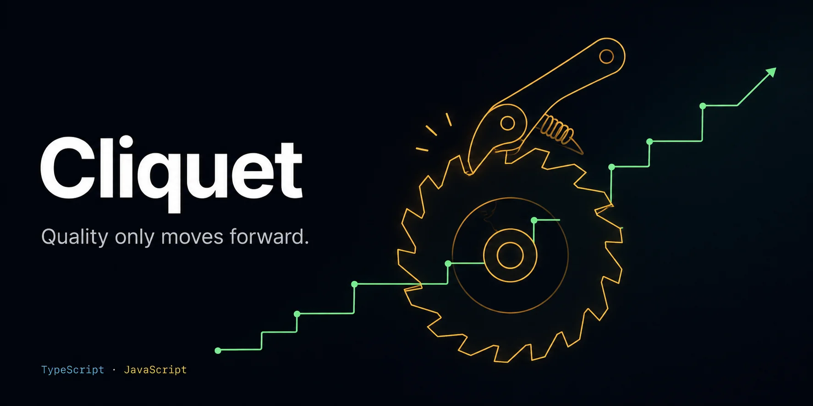

<p align="center">
  
</p>

> **Cliquet** (French for "ratchet", pronounced /kli.kɛ/ — "clee-KEH", silent *t*) — like a ratchet, quality only moves forward.

**The quality ratchet for TypeScript/JavaScript.** Cliquet turns your project's quality metrics into a one-way street: they can improve or stay the same — **never regress**. One command, nine quality gates, a single versioned baseline, and a CI that blocks any step backward.

```bash
npx cliquet init && npx cliquet check
```

Cliquet orchestrates the tools your project already uses (ESLint, Prettier, Biome, tsc, Vitest, Jest), adds its own built-in checks (security, duplication, complexity, file size, bundle size), compares everything against a baseline committed to your repo, and fails your CI when any metric gets worse.

## Why Cliquet?

- **Ratchet by baseline, not by diff.** Diff-based tools only check the code you touched. A versioned baseline catches regressions no diff ever shows: a bundle growing kilobyte by kilobyte, coverage dropping because someone deleted tests, duplication quietly piling up. The global number never gets worse — period.
- **Zero-config gates.** Nine gates work out of the box. Cliquet detects the tools you already have by their config files — no plugins to wire, no metric tests to write, no YAML to learn.
- **Heterogeneous metrics, one mechanism.** Security advisories, test coverage, duplication, cyclomatic complexity, and gzip bundle size all go through the same ratchet. No other tool holds the line across all of them at once.
- **Security built in.** Beyond `npm audit`, 12 source-level security rules ship out of the box: hardcoded secrets, injection patterns, unsafe HTML, supply-chain red flags, and more.
- **Made for the AI-coding era.** Cliquet detects when it runs inside an AI coding agent (Claude Code, Cursor, …) and switches to structured JSON automatically — a quality contract your agents can actually read and act on.
- **Fixes, not just reports.** `cliquet fix` auto-repairs what can be repaired (style, lint, performance) and re-checks in the same run.
- **Legacy-friendly adoption.** Set the baseline to where your codebase is today; the ratchet holds that line and only tightens from there. No need to pay off years of debt on day one.
- **A simple devDependency.** No server, no dashboard, no account, no lock-in. The quality floor is a JSON file in your repo — reviewable in PRs, auditable in git history.

## How it compares

| | **Cliquet** | Betterer | qlty | Trunk Check | SonarQube |
|---|---|---|---|---|---|
| Regression model | Versioned baseline (global) | Snapshot (per test) | Diff (new issues) | Diff (hold-the-line) | Diff ("new code") |
| Ready-made gates | 9, zero config | Write your own | Linters only | Linters only | Server rules |
| Coverage ratchet | ✅ | DIY | ❌ | ❌ | New code only |
| Bundle size gate | ✅ | DIY | ❌ | ❌ | ❌ |
| Built-in security rules | ✅ 12 rules | ❌ | Via plugins | Via plugins | ✅ |
| Auto-fix command | ✅ | ❌ | ✅ | ✅ | ❌ |
| AI-agent output | ✅ auto-detected | ❌ | ❌ | ❌ | ❌ |
| Runs as | npm devDependency | npm devDependency | Rust binary + platform | Binary + platform | Server/SaaS |

Betterer shares the ratchet philosophy but asks you to write every metric as code — and its last release was an alpha over a year ago. qlty and Trunk are excellent multi-language meta-linters, but they prevent regression per diff, not per baseline, and skip coverage and bundle size entirely. Cliquet is the focused option: TypeScript/JavaScript, batteries included, actively maintained.

## Install

```bash
npm install --save-dev @craverlab/cliquet
```

Requires Node.js ≥ 20.11.

## Quick start

```bash
# Create the baseline with default thresholds
npx cliquet init

# Run all gates and compare against the baseline
npx cliquet check

# Auto-fix what can be fixed (style, lint, performance), then re-check
npx cliquet fix
```

## Quality gates

Gates run in parallel. A regression in any gate blocks with exit code 1.

| # | Gate | Tool | Default threshold |
|---|------|------|-------------------|
| 1 | Security Audit | `npm`/`pnpm`/`yarn audit` + 12 built-in checks | 0 critical/high advisories, 0 findings |
| 2 | Code Style | Prettier and/or Biome | 0 violations |
| 3 | Static Analysis | ESLint, Biome, `tsc --noEmit` | 0 errors |
| 4 | Test Coverage | Vitest or Jest | 85% minimum |
| 5 | Duplication | jscpd (bundled) | 2% maximum |
| 6 | File Size | built-in | 1000 lines per file |
| 7 | Cyclomatic Complexity | built-in (TS compiler API) | Block at CCN 50, warn at 20 |
| 8 | Performance | ESLint (internal ruleset) + built-in condition-order analyzer | 0 violations |
| 9 | Bundle Size | built-in (gzip of your build dir) | Ratchet on measured size |

Tools are detected by their config files (`.prettierrc`, `biome.json`, `eslint.config.*`, `.eslintrc*`, `tsconfig.json`) and resolved from `node_modules/.bin`, then `$PATH`. **A tool that isn't installed or configured makes its gate skip — it never fails.** A tool that crashes turns its gate into `error`, which fails the run: broken tooling can't pass silently.

## The baseline — `cliquet.baseline.json`

`cliquet init` creates a baseline at your project root. Commit it — it is the quality floor:

- **Regressed vs baseline → fail** with prioritized actions pointing at files.
- **Equal → pass.**
- **Improved → pass**, and the report suggests updating the baseline so the ratchet tightens.

**Adopting on a legacy codebase:** defaults are aspirational, so the first `check` may fail. Edit the baseline thresholds to the values `check` reports (never looser than measured) — from there the ratchet holds that line. Security findings are zero-tolerance and have no threshold: fix the code, or disable the specific rule under `security.rules`.

### Scoping with `source_dirs`

```jsonc
{
  "source_dirs": {
    "paths": ["src", "app", "lib"],      // where cliquet looks for source files
    "exclude": ["app/api/gen", "**/*.gen.ts"]  // what it must NOT score
  }
}
```

`exclude` takes [picomatch](https://github.com/micromatch/picomatch) globs relative to the project root. A bare path (`"app/api/gen"`) excludes the whole subtree; trailing slashes are tolerated. Use it for **committed codegen** — generated API clients, `.d.ts` outputs — that would otherwise drown the duplication/file-size ratchets in numbers you don't control.

The exclusion reaches the built-in gates (file size, complexity, security content rules, condition-order), jscpd (duplication) and every eslint invocation — including the `cliquet fix` fixers, so auto-fixes never rewrite generated files. It does **not** reach prettier/biome/tsc/coverage: those tools have their own ignore mechanisms (`.prettierignore`, `biome.json`, tsconfig `exclude`, your test runner's coverage config).

Patterns containing `,` or `{}` and negation patterns (`!`) are rejected at load with exit 2 — list patterns separately instead.

## Built for AI coding agents

> "I don't review code written by agents. I measure things like test coverage,
> dependency structure, cyclomatic complexity, module sizes, mutation testing, etc.
> Much can be inferred about the quality of the code from those metrics.
> The code itself I leave to the AI."
>
> — [Robert C. Martin (Uncle Bob)](https://x.com/unclebobmartin/status/2044114698451476492), the tweet that inspired Cliquet

AI agents write more of your code every day — Cliquet makes sure they can't lower the bar. When it detects it is running inside an AI coding agent (Claude Code, Cursor, and others), it automatically switches to structured JSON output, so the agent gets machine-readable gate results, regressions, and prioritized actions instead of ANSI art. An explicit `--format` always wins.

```bash
cliquet check                    # human-readable (default)
cliquet check --plain            # no ANSI colors
cliquet check --format json      # structured output for CI and AI agents
cliquet check --format github    # ::error::/::warning:: annotations
```

### Exit codes

| Code | Meaning |
|------|---------|
| 0 | All gates passed (skipped gates don't fail) |
| 1 | At least one gate failed or errored |
| 2 | Usage/config error (invalid baseline, bad flag, missing path) |

## Security checks

Beyond the package-manager audit, 12 built-in rules scan your sources: hardcoded secrets, secrets in client-exposed env vars (`VITE_`, `NEXT_PUBLIC_`, …), `eval`/`new Function`, command injection, SQL injection, unsanitized HTML (`dangerouslySetInnerHTML`, `v-html`, `innerHTML`), path traversal from request input, insecure RNG in security contexts, disabled TLS verification, `target="_blank"` without `rel="noopener"`, missing sensitive entries in `.gitignore`, and freshly-published dependencies (< 3 days). Every rule can be toggled in the baseline.

## Bundle size

The bundle gate measures the gzip size of `.js`/`.mjs`/`.cjs`/`.css` files in your build directory (`dist`, `build`, or `.output`). It doesn't run your build — run it first, then `cliquet init` records the current size and the ratchet holds it. When the gate fails it lists the 5 largest files.

## CI example (GitHub Actions)

```yaml
name: Quality Gate
on:
  pull_request:
    branches: [main]
jobs:
  quality:
    runs-on: ubuntu-latest
    steps:
      - uses: actions/checkout@v4
      - uses: actions/setup-node@v4
        with:
          node-version: 22
      - run: npm ci
      - run: npm run build --if-present   # so the bundle gate can measure
      - run: npx cliquet check --format github --plain
```

## CLI reference

```
cliquet init [--force]                  create the baseline (--force overwrites)
cliquet check [--fix]                   run gates; --fix runs fixers on failure and re-checks
cliquet fix [--no-check]                run auto-fixers, then check

Global flags:
  --path <dir>          project root (default: cwd)
  --format <fmt>        human | json | json-pretty | github
  --plain               disable ANSI colors
  --timeout <seconds>   per-gate timeout (default: 300)
```

## License

MIT

## Credits

Cliquet is inspired by [Catraca](https://github.com/b7s/catraca) by [b7s](https://github.com/b7s) — the original PHP quality guardian that coined the turnstile/ratchet approach this project brings to the TypeScript/JavaScript ecosystem ("catraca" is Portuguese for turnstile/ratchet, just as "cliquet" is French for ratchet). If you work with PHP, go use it.
